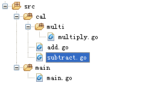

## Go - 包引用说明

和其他大多数语言一样，Go也存在包，并使用package关键字定义一个包。首先介绍在程序中如何引入包，引入包有以下几种方式：

　　1. 最简单的方式引入一个包的方式是直接引入包，例如：
```go
　　　　import "fmt"
　　　　import "os"
```
　　2. 也可以通过下面的方式将包一块引入，并写在括号内：

```go
　　　　import (
　　　　　　"fmt"
　　　　　　"os"
　　　　)
```
　　通过上面的方式，可以引入系统包或第三方的包，下面重点介绍如何引入自定义的包和函数：

　　一般我们将主程序放在src的mian文件夹下(主程序中包含main函数，并将主程序的包名写为package main)，将其他模块放在相应的文件夹下，例如下图所示

　　 

 
　　主函数在main.go文件中，主函数名也可以为其他，但必须包含main函数。在Go编程中，怎么引入自己编写的模块呢，例如在main.go中如何调用add.go、subtract.go或者是multiply.go中的文件。

　　add.go与subtract.go在cal文件夹下，所以这两个程序的包名为cal（package cal），multiply.go在multi文件夹下，所以程序的包名为multi（package multi）。如果mian函数要调用add.go或者subtract.go中的函数，必须要引入包"cal"（import "cal"）。要调用multiply.go中的函数，那就要引入包"multi"，如果我们在程序中直接写import "multi"，编译器会提示我们can not find package "multi"。因为我们的"multi"包在包"cal"下，所以我们要把包名写完整"cal/multi"，下面就可以调用各个文件中的函数了。

　　Go中如果函数名的首字母大写，表示该函数是公有的，可以被其他程序调用，如果首字母小写，该函数就是是私有的，因此我们只能调用add.go、subtract.go或者multiply.go中的公有函数。具体调用如下图：

　　

　　add.go
```go
package main
import (
    "fmt"
    "cal"
    "cal/multi"
)

func main() {
    result := cal.Add(1, 2)
    fmt.Printf("%d\n)
}
```
　　

　　subtract.go
```go
```
　　

　　multiply.go
```go
```
　　

　　最后注意：文件名可以和该包名不一致，但文件中使用的包名必须要和该包名一致。